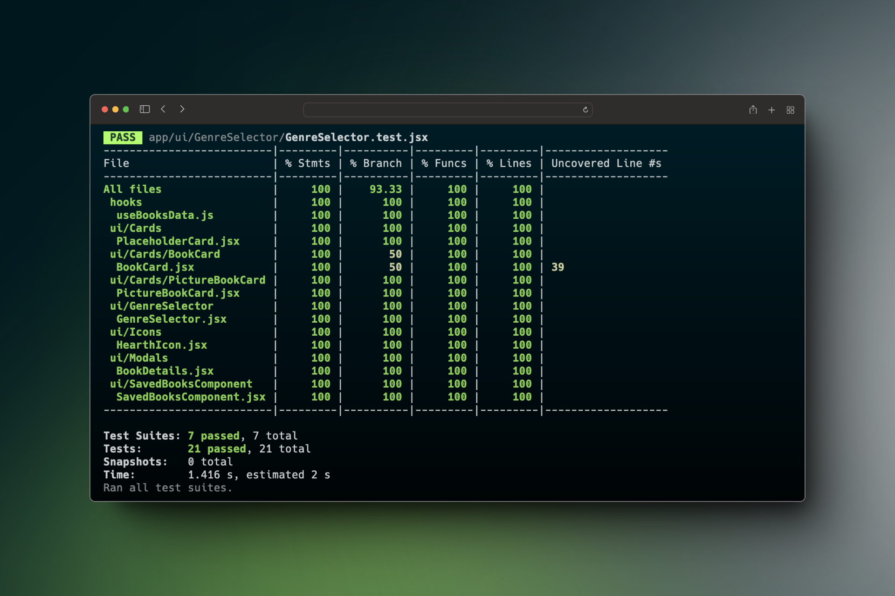
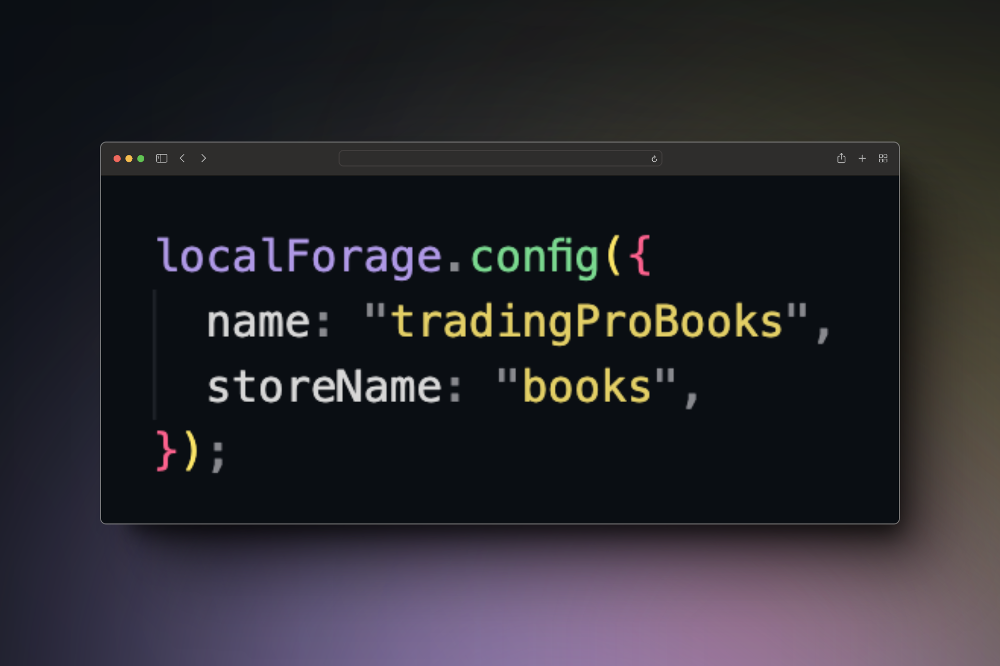
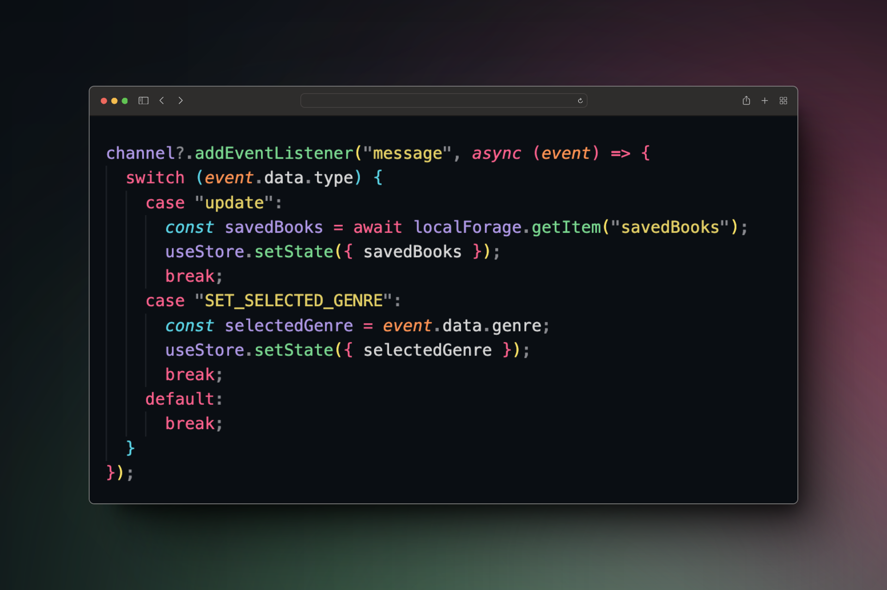

# Prueba técnica de TradingPro

El objetivo de esta prueba es diseñar e implementar una pequeña aplicación web de lista de libros utilizando las herramientas de tu elección siempre utilizando JavaScript como lenguaje y NextJS como framework. El resultado está desplegado en Netlify: https://tradingpro-hector-matias.netlify.app/

## Contexto

Somos un sello editorial de libros multinacional. Queremos ofrecer a nuestro público una forma de ver nuestro catálogo y poder guardar los libros que les interesan en una lista de lectura.
Para ello, queremos desarrollar una aplicación web que permita a los usuarios ver los libros disponibles y crear una lista de lectura. Ten en cuenta que:
No sabemos si el framework que utilicemos ahora será el definitivo, pero querremos reutilizar el máximo de código posible. La aplicación debe ser fácil de usar y agradable a la vista.
Tenemos un 80% de usuarios que vienen de navegadores de escritorio.
Usa el archivo books.json para obtener los datos de los libros. Puedes añadir más libros si lo deseas, siempre y cuando siga la misma estructura.

## 🚀 Deployment

Para ejecutar esta aplicación, sigue los siguientes pasos:

- Clona este repositorio en tu máquina local.
- Asegúrate de tener Node.js instalado en su sistema.
- Abre una terminal y navegue hasta la carpeta raíz del proyecto.
- Ejecuta el siguiente comando para instalar las dependencias del proyecto.

```bash
npm install
```

- Una vez termine la instalación, ejecuta el sigueinte comando para arrancar la aplicación

```bash
npm run dev
```

- Abre tu navegador y entra en la siguiente URL: http://localhost:3000

## 🧪 Tests

Para ejecutar los tests puedes ejecutar cualquiera de los siguientes comandos

```bash
  npm run test
```

```bash
  npm run test:watch
```

```bash
  npm run test:coverage
```



## 📝 Documentation

Para trabajar con este proyecto hay que tener las siguientes cosas en cuenta.

Usamos Husky para que al hacer un commit se ejecute el linter y al hacer push se ejecuten tanto prettier como los tests.

El store está montado con zustand y con localforage para que el estado sea persistente aunque recarguemos la aplicación.


Para que el estado se actualice en más de una pestaña a la vez he utilizado un BroadcastChannel para detectar ahí los eventos.


## 📚 Tech Stack

- Next.js
- TailwindCSS
- Zustand
- Jest
- Husky
- Prettier
- localforage
